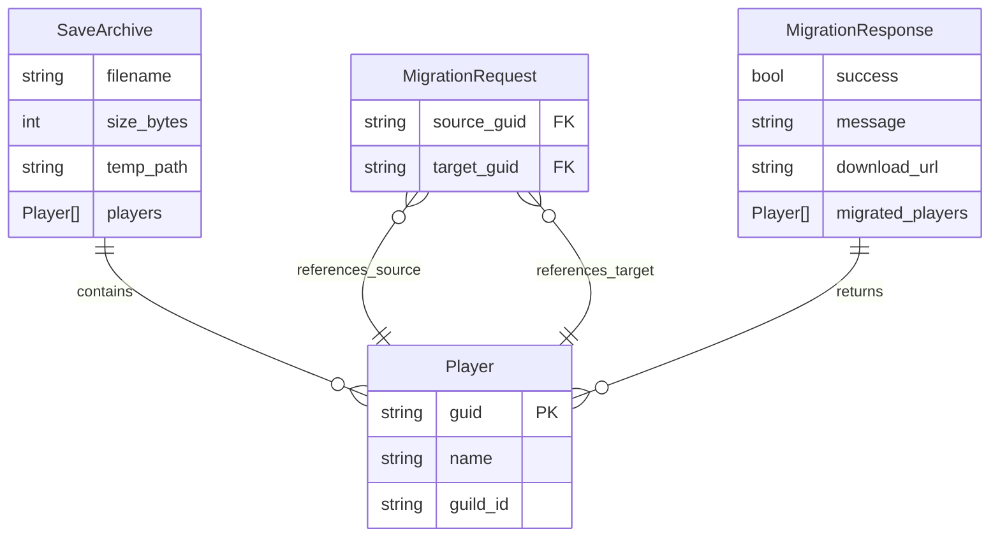

# Data Model: Web-Based Palworld Save Migration Tool

**Date**: 2025-11-08 | **Version**: 1.0

## Overview

This document defines the data structures used throughout the web-based migration tool. Models are implemented as Pydantic classes for FastAPI validation and serialization.

---

## Entities

### 1. Player

Represents a Palworld player character extracted from save files.

**Fields**:
| Field | Type | Required | Validation | Description |
|-------|------|----------|------------|-------------|
| `guid` | `str` | Yes | 32 hex chars | Player GUID without dashes (e.g., "00000000000000000000000000000001") |
| `name` | `str` | Yes | 1-50 chars | Player display name |
| `guild_id` | `str` | Yes | UUID format | Guild instance ID this player belongs to |

**Relationships**:
- Belongs to one Guild (via `guild_id`)
- Has one PlayerSaveFile (via `guid`)

**State Transitions**: N/A (immutable read-only data from save files)

**Validation Rules**:
- `guid` must be exactly 32 hexadecimal characters
- `name` cannot be empty or whitespace-only
- `guild_id` must be valid UUID format

**Example**:
```json
{
  "guid": "00000000000000000000000000000001",
  "name": "Tamil Gamers Tech",
  "guild_id": "99e60934-44f3-e515-2001-e7b71"
}
```

**Pydantic Model**:
```python
from pydantic import BaseModel, Field, field_validator
import re

class Player(BaseModel):
    guid: str = Field(..., min_length=32, max_length=32, description="32-character hex GUID")
    name: str = Field(..., min_length=1, max_length=50, description="Player display name")
    guild_id: str = Field(..., description="Guild instance ID (UUID format)")
    
    @field_validator('guid')
    def validate_guid_format(cls, v):
        if not re.match(r'^[0-9A-Fa-f]{32}$', v):
            raise ValueError('GUID must be 32 hexadecimal characters')
        return v.upper()
```

---

### 2. SaveArchive

Represents an uploaded save file archive (zip).

**Fields**:
| Field | Type | Required | Description |
|-------|------|----------|-------------|
| `filename` | `str` | Yes | Original filename from upload |
| `size_bytes` | `int` | Yes | File size in bytes |
| `temp_path` | `str` | Internal | Server-side temporary path |
| `players` | `List[Player]` | No | Extracted players (populated after analysis) |

**Lifecycle**:
1. **Uploaded**: File received, stored in temp directory
2. **Validated**: Structure checked (Level.sav + Players/ folder present)
3. **Analyzed**: Players extracted and populated
4. **Migrated**: GUID swap performed, new archive generated
5. **Cleaned**: Temporary files deleted

**Validation Rules**:
- `size_bytes` must be > 0 and <= 500MB (524,288,000 bytes)
- Archive must contain `Level.sav` at root or one level deep
- Archive must contain `Players/` directory with at least one `.sav` file
- All player `.sav` files must be parseable by palworld_save_tools

**Pydantic Model**:
```python
from pydantic import BaseModel, Field
from typing import List, Optional

class SaveArchive(BaseModel):
    filename: str = Field(..., description="Original upload filename")
    size_bytes: int = Field(..., gt=0, le=524288000, description="File size (max 500MB)")
    temp_path: Optional[str] = Field(None, description="Server temp path (internal)")
    players: Optional[List[Player]] = Field(default_factory=list, description="Extracted players")
```

---

### 3. MigrationRequest

Request payload for performing GUID swap.

**Fields**:
| Field | Type | Required | Description |
|-------|------|----------|-------------|
| `source_guid` | `str` | Yes | Old player GUID to migrate from |
| `target_guid` | `str` | Yes | New player GUID to migrate to |

**Validation Rules**:
- Both GUIDs must be 32 hex characters
- `source_guid` ≠ `target_guid`
- Both GUIDs must exist in the uploaded save file

**Business Rules**:
- Source player's data will be assigned to target GUID
- Target player's data will be assigned to source GUID (swap operation)
- Guild memberships are updated accordingly
- Ownership records (pals, bases, items) are swapped

**Pydantic Model**:
```python
from pydantic import BaseModel, Field, model_validator

class MigrationRequest(BaseModel):
    source_guid: str = Field(..., pattern=r'^[0-9A-Fa-f]{32}$', description="Source player GUID")
    target_guid: str = Field(..., pattern=r'^[0-9A-Fa-f]{32}$', description="Target player GUID")
    
    @model_validator(mode='after')
    def validate_guids_differ(self):
        if self.source_guid.upper() == self.target_guid.upper():
            raise ValueError('Source and target GUIDs must be different')
        return self
```

---

### 4. MigrationResponse

Response payload after successful migration.

**Fields**:
| Field | Type | Required | Description |
|-------|------|----------|-------------|
| `success` | `bool` | Yes | True if migration completed |
| `message` | `str` | Yes | Human-readable status message |
| `download_url` | `str` | No | URL to download migrated zip (if success=True) |
| `migrated_players` | `List[Player]` | No | Updated player list with swapped GUIDs |

**Example**:
```json
{
  "success": true,
  "message": "Migration completed successfully. Download your migrated save.",
  "download_url": "/download/migrated_abc123.zip",
  "migrated_players": [
    {"guid": "00000000000000000000000000000001", "name": "Raptor", ...},
    {"guid": "1b31c53d000000000000000000000000", "name": "Tamil Gamers Tech", ...}
  ]
}
```

**Pydantic Model**:
```python
from pydantic import BaseModel
from typing import List, Optional

class MigrationResponse(BaseModel):
    success: bool
    message: str
    download_url: Optional[str] = None
    migrated_players: Optional[List[Player]] = None
```

---

### 5. ErrorResponse

Standardized error response for API failures.

**Fields**:
| Field | Type | Required | Description |
|-------|------|----------|-------------|
| `error` | `str` | Yes | Error type/code (e.g., "INVALID_STRUCTURE") |
| `message` | `str` | Yes | Human-readable error description |
| `details` | `dict` | No | Additional context (e.g., missing files) |

**Example**:
```json
{
  "error": "INVALID_STRUCTURE",
  "message": "Level.sav not found in uploaded archive",
  "details": {
    "files_found": ["Players/abc.sav", "LevelMeta.sav"],
    "expected": "Level.sav"
  }
}
```

**Pydantic Model**:
```python
from pydantic import BaseModel
from typing import Optional, Dict, Any

class ErrorResponse(BaseModel):
    error: str
    message: str
    details: Optional[Dict[str, Any]] = None
```

---

## Entity Relationships



---

## State Machine: Migration Workflow

```
┌─────────────┐
│   Upload    │
│   Archive   │
└──────┬──────┘
       │
       v
┌─────────────┐     ┌──────────────┐
│  Validate   │────>│ ValidationError│
│  Structure  │     └──────────────┘
└──────┬──────┘
       │
       v
┌─────────────┐     ┌──────────────┐
│   Extract   │────>│  ParseError  │
│   Players   │     └──────────────┘
└──────┬──────┘
       │
       v
┌─────────────┐
│   Present   │<────────┐
│   Players   │         │
└──────┬──────┘         │
       │                │
       v                │
┌─────────────┐         │
│   Select    │         │
│Source/Target│         │
└──────┬──────┘         │
       │                │
       v                │
┌─────────────┐     ┌──┴───────────┐
│   Perform   │────>│MigrationError│
│  Migration  │     └──────────────┘
└──────┬──────┘
       │
       v
┌─────────────┐
│  Generate   │
│  Download   │
└──────┬──────┘
       │
       v
┌─────────────┐
│   Cleanup   │
│  Temp Files │
└─────────────┘
```

---

## Validation Matrix

| Validation | Enforced At | Error Type | Error Code |
|------------|-------------|------------|------------|
| GUID format (32 hex) | Request | 422 Unprocessable Entity | INVALID_GUID |
| File size (≤500MB) | Upload | 413 Payload Too Large | FILE_TOO_LARGE |
| Archive structure | Analysis | 400 Bad Request | INVALID_STRUCTURE |
| GUIDs differ | Request | 400 Bad Request | DUPLICATE_GUID |
| GUIDs exist in save | Migration | 404 Not Found | GUID_NOT_FOUND |
| Save file parseable | Analysis | 400 Bad Request | CORRUPT_SAVE |

---

## Performance Considerations

- **Player extraction**: O(n) where n = number of players in save (~10-100 typical)
- **GUID lookup**: O(1) using dict/hash map for player index
- **File operations**: Async I/O for large zip handling
- **Memory usage**: Stream processing to keep <100MB RAM even with 500MB uploads

---

## Security Constraints

- **No persistent storage**: All data in temp directories with auto-cleanup
- **Input sanitization**: Pydantic validation prevents injection attacks
- **Path traversal protection**: Validate zip entries don't escape temp directory
- **Rate limiting**: Not implemented in v1 (localhost only)
