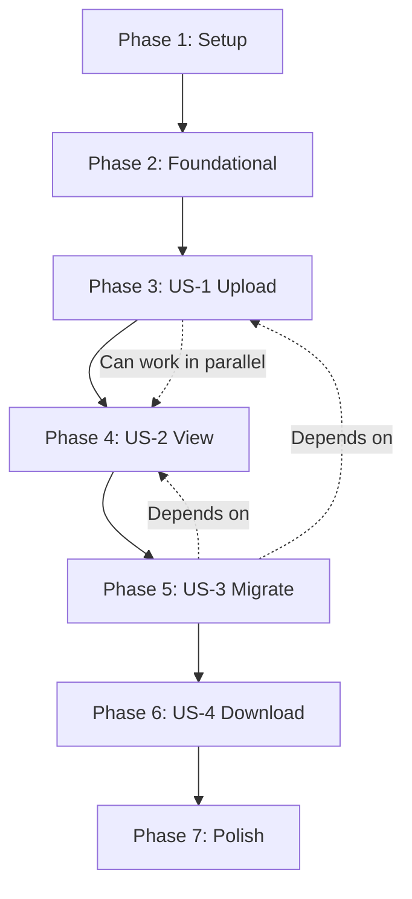

# Implementation Tasks: Web-Based Palworld Save Migration Tool

**Branch**: `master` | **Date**: 2025-11-08 | **Spec**: [spec.md](./spec.md) | **Plan**: [plan.md](./plan.md)

---

## Overview

This document breaks down the implementation of the web-based Palworld save migration tool into executable tasks. The tool allows users to upload save archives via a browser, view players in dual-panel tables, select source and target GUIDs, and download migrated saves.

**Total Estimated Tasks**: 116  
**Security Tasks**: 10 (🔒 CRITICAL)  
**Estimated Timeline**: 9-12 hours  
**MVP Scope**: US-1 + US-2 (Upload & View Players) + Security Validation

---

## 🔒 Security First

**CRITICAL**: User-uploaded zip files pose significant security risks. The following threats are mitigated:

1. **Path Traversal** (../ in zip entries) → Tasks T037a, T024b
2. **Absolute Paths** (/etc/passwd, C:\Windows) → Task T037b, T024b
3. **Zip Bombs** (decompression attacks) → Task T037d, T024b
4. **Malicious Files** (.exe, .dll, .sh) → Task T037c, T024b
5. **Resource Exhaustion** (too many files) → Task T037e, T024b

**All security tasks are MANDATORY** before production deployment. See [SECURITY.md](./SECURITY.md) for detailed threat analysis.

---

## Task Organization

Tasks are organized by **User Story** to enable independent, incremental development:

- **Phase 1**: Setup & Project Initialization
- **Phase 2**: Foundational (Core Library Migration)
- **Phase 3**: US-1 - Upload Save Archive
- **Phase 4**: US-2 - View Player Mappings  
- **Phase 5**: US-3 - Execute Migration
- **Phase 6**: US-4 - Download Migrated Save
- **Phase 7**: Polish & Cross-Cutting Concerns

---

## Phase 1: Setup & Project Initialization

**Goal**: Set up project structure, dependencies, and foundational configuration.

**Tasks**:

- [ ] T001 Create `web_service/` directory structure per implementation plan
- [ ] T002 Create `web_service/__init__.py` (empty marker file)
- [ ] T003 Create `web_service/core/` directory for migrated logic
- [ ] T004 Create `web_service/core/__init__.py` (empty marker file)
- [ ] T005 Create `web_service/static/` directory for CSS/JS
- [ ] T006 Create `web_service/templates/` directory for HTML
- [ ] T007 Create `web_service/tests/` directory
- [ ] T008 Create `web_service/tests/fixtures/` directory for test data
- [ ] T009 [P] Create root `pyproject.toml` with UV dependencies (fastapi, uvicorn, python-multipart, jinja2, loguru)
- [ ] T010 [P] Add dev dependencies to pyproject.toml (pytest, httpx, pytest-asyncio, ruff)
- [ ] T011 Run `uv sync` to install all dependencies and create uv.lock
- [ ] T012 [P] Create `.gitignore` with Python/UV exclusions (__pycache__, .venv, *.pyc, uv.lock, temp files)
- [ ] T013 [P] Create `web_service/tests/conftest.py` with pytest fixtures (test_client, sample_save_data)

**Duration**: ~30 minutes

---

## Phase 2: Foundational - Core Library Migration

**Goal**: Copy and adapt `palworld_save_tools` library, refactor migration logic to remove tkinter dependencies. This is a **blocking phase** - must complete before user stories.

**Tasks**:

- [ ] T014 Copy `gui_palworld_tool/Assets/palworld_save_tools/` directory to `web_service/core/palworld_save_tools/`
- [ ] T015 Update imports in `web_service/core/palworld_save_tools/__init__.py` to use absolute imports
- [ ] T016 Update imports in `web_service/core/palworld_save_tools/archive.py`
- [ ] T017 Update imports in `web_service/core/palworld_save_tools/gvas.py`
- [ ] T018 Update imports in `web_service/core/palworld_save_tools/json_tools.py`
- [ ] T019 Update imports in `web_service/core/palworld_save_tools/palsav.py`
- [ ] T020 Update imports in `web_service/core/palworld_save_tools/paltypes.py`
- [ ] T021 [P] Copy `commands/` subdirectory and update imports
- [ ] T022 [P] Copy `compressor/` subdirectory and update imports
- [ ] T023 [P] Copy `rawdata/` subdirectory (all modules) and update imports
- [ ] T024 Create `web_service/core/save_parser.py` with `extract_players(level_sav_path)` function (refactored from fix_host_save.py::populate_player_lists)
- [ ] T024a Create `web_service/core/security.py` with secure zip validation and extraction functions
- [ ] T024b Add `validate_zip_safety()` to security.py - check path traversal, absolute paths, file types
- [ ] T024c Add `safe_extract_zip()` to security.py - extract with security checks, return extracted path
- [ ] T024d Add `cleanup_temp_directory()` to security.py - securely delete temp files after use
- [ ] T025 Create `web_service/core/migration.py` with `migrate_guids()` function (refactored from fix_host_save.py::fix_save, NO tkinter)
- [ ] T026 Add `copy_dps_file()` helper to migration.py (from fix_host_save.py)
- [ ] T027 Add `deep_swap_ownership()` helper to migration.py (from fix_host_save.py)
- [ ] T028 Test basic save parsing: create `web_service/tests/test_save_parser.py` with test for extract_players()
- [ ] T029 Test migration logic: create `web_service/tests/test_migration.py` with test for migrate_guids()

**Duration**: ~2-3 hours

**Validation**: Run `uv run pytest web_service/tests/test_save_parser.py web_service/tests/test_migration.py` - all tests pass

---

## Phase 3: US-1 - Upload Save Archive

**Goal**: Implement file upload endpoint with validation. Users can upload a zip file containing Level.sav and Players/ folder.

**User Story**: US-1  
**Acceptance Criteria**:
- Web page accepts .zip file upload via file picker
- Backend validates presence of Level.sav and Players/ folder  
- Returns error if structure invalid
- Preserves original file for migration

**Tasks**:

- [ ] T030 [US1] Create `web_service/models.py` with `Player` Pydantic model per data-model.md
- [ ] T031 [P] [US1] Add `ErrorResponse` Pydantic model to models.py
- [ ] T032 [US1] Create `web_service/app.py` with FastAPI app initialization
- [ ] T033 [US1] Add CORS middleware to app.py (allow localhost only)
- [ ] T034 [US1] Add Jinja2Templates configuration pointing to templates/
- [ ] T035 [US1] Add StaticFiles mount for /static route
- [ ] T036 [US1] Implement `POST /analyze` endpoint in app.py - accept UploadFile, validate zip structure
- [ ] T037 [US1] Add file size validation (max 500MB) using FastAPI dependencies
- [ ] T037a [US1] Add SECURITY: Validate zip file before extraction - check for path traversal attacks (../ in entry names)
- [ ] T037b [US1] Add SECURITY: Reject zip entries with absolute paths (e.g., /etc/passwd, C:\Windows)
- [ ] T037c [US1] Add SECURITY: Scan zip for dangerous file types (no .exe, .dll, .so, .sh, .bat, .ps1)
- [ ] T037d [US1] Add SECURITY: Limit total extracted size (prevent zip bombs - max 1GB extracted)
- [ ] T037e [US1] Add SECURITY: Validate zip entry count (max 1000 files to prevent resource exhaustion)
- [ ] T038 [US1] Add zip structure validation: check for Level.sav at root or one level deep
- [ ] T039 [US1] Add Players/ folder validation: must exist with at least one .sav file
- [ ] T040 [US1] Return ErrorResponse with INVALID_STRUCTURE if validation fails
- [ ] T041 [US1] Create minimal `web_service/templates/index.html` with file upload form
- [ ] T042 [P] [US1] Add basic CSS in `web_service/static/styles.css` (dark theme, form styling)
- [ ] T043 [US1] Add JavaScript in `web_service/static/app.js` for file upload handling (fetch to /analyze)

**Testing** (Optional - only if TDD requested):
- [ ] T044 [P] [US1] Create `web_service/tests/test_api.py` with test_upload_valid_save()
- [ ] T045 [P] [US1] Add test_upload_invalid_structure() to test_api.py
- [ ] T046 [P] [US1] Add test_upload_file_too_large() to test_api.py

**Duration**: ~1 hour

**Independent Test**: Upload a real Palworld save zip via UI, verify validation messages appear correctly.

---

## Phase 4: US-2 - View Player Mappings

**Goal**: Display extracted players in dual-panel tables with search/filter. User can see and select source and target players.

**User Story**: US-2  
**Acceptance Criteria**:
- UI displays two side-by-side panels
- Each panel shows: GUID, Player Name, Guild ID
- Search/filter capability in each panel
- Visual distinction between selected source and target

**Tasks**:

- [ ] T047 [US2] Update `POST /analyze` endpoint to call save_parser.extract_players() and return player list JSON
- [ ] T048 [US2] Update index.html with dual-panel layout (CSS Grid: 2 columns)
- [ ] T049 [US2] Add left panel table: Source Player (GUID, Name, Guild ID columns)
- [ ] T050 [US2] Add right panel table: Target Player (GUID, Name, Guild ID columns)
- [ ] T051 [P] [US2] Add search input above left panel in index.html
- [ ] T052 [P] [US2] Add search input above right panel in index.html
- [ ] T053 [US2] Update app.js to populate both tables from /analyze response
- [ ] T054 [US2] Add row click handlers in app.js to track selected source GUID
- [ ] T055 [US2] Add row click handlers in app.js to track selected target GUID
- [ ] T056 [P] [US2] Implement search/filter logic in app.js for source table (filter by GUID/name/guild)
- [ ] T057 [P] [US2] Implement search/filter logic in app.js for target table (filter by GUID/name/guild)
- [ ] T058 [US2] Add selection highlighting CSS in styles.css (e.g., .selected row background color)
- [ ] T059 [US2] Add table styling in styles.css (zebra striping, hover effects, dark theme colors)
- [ ] T060 [US2] Update app.js to enable "Migrate" button only when both source and target selected

**Testing** (Optional):
- [ ] T061 [P] [US2] Add test_analyze_returns_players() to test_api.py
- [ ] T062 [P] [US2] Add test_analyze_empty_save() to test_api.py

**Duration**: ~2 hours

**Independent Test**: Upload save, verify player tables populate correctly, test search filters, click rows and verify Migrate button enables.

---

## Phase 5: US-3 - Execute Migration

**Goal**: Implement migration endpoint that performs GUID swap and prepares migrated save for download.

**User Story**: US-3  
**Acceptance Criteria**:
- "Migrate" button triggers migration
- Backend calls migration.migrate_guids() with selected GUIDs
- Non-interactive mode (no GUI dialogs)
- Progress indicator during migration
- Error handling with user-friendly messages

**Tasks**:

- [ ] T063 [US3] Add `MigrationRequest` Pydantic model to models.py
- [ ] T064 [US3] Implement `POST /migrate` endpoint in app.py accepting file + source_guid + target_guid
- [ ] T064a [US3] Add SECURITY: Reuse security validation from T037a-e before extracting in /migrate
- [ ] T065 [US3] Extract uploaded zip to temp directory in /migrate handler using secure extraction helper
- [ ] T066 [US3] Call core.migration.migrate_guids() with extracted folder path and GUIDs
- [ ] T067 [US3] Handle migration errors: catch exceptions and return ErrorResponse with MIGRATION_FAILED
- [ ] T068 [US3] Validate GUIDs exist in save before migration: return GUID_NOT_FOUND if missing
- [ ] T069 [US3] Validate source_guid != target_guid: return DUPLICATE_GUID if same
- [ ] T070 [US3] Create new zip archive from migrated folder in temp directory
- [ ] T071 [US3] Add progress indicator overlay in index.html (spinner + "Migrating..." text)
- [ ] T072 [US3] Update app.js to show progress indicator when "Migrate" button clicked
- [ ] T073 [US3] Update app.js to call POST /migrate with FormData (file, source_guid, target_guid)
- [ ] T074 [US3] Add error toast notification in index.html/app.js to display migration errors

**Testing** (Optional):
- [ ] T075 [P] [US3] Add test_migrate_valid_guids() to test_api.py
- [ ] T076 [P] [US3] Add test_migrate_duplicate_guids() to test_api.py
- [ ] T077 [P] [US3] Add test_migrate_guid_not_found() to test_api.py

**Duration**: ~2 hours

**Independent Test**: Upload save, select two players, click Migrate, verify progress indicator appears and no errors occur.

---

## Phase 6: US-4 - Download Migrated Save

**Goal**: Return migrated save as downloadable zip file with proper headers.

**User Story**: US-4  
**Acceptance Criteria**:
- Automatic download of migrated.zip after migration
- Zip contains updated Level.sav and Players/ folder
- Clear success message
- Original uploaded file remains unmodified

**Tasks**:

- [ ] T078 [US4] Update `POST /migrate` to return StreamingResponse with zip bytes
- [ ] T079 [US4] Set Content-Disposition header to `attachment; filename="migrated.zip"`
- [ ] T080 [US4] Set Content-Type header to `application/zip`
- [ ] T081 [US4] Clean up temp directories after zip is sent
- [ ] T082 [US4] Update app.js to handle blob response from /migrate
- [ ] T083 [US4] Create download link in app.js and trigger click to download zip
- [ ] T084 [US4] Add success toast notification in index.html/app.js with "Migration complete! Download starting..."
- [ ] T085 [US4] Add instructions in success message: "Extract zip and replace your save folder"

**Testing** (Optional):
- [ ] T086 [P] [US4] Add test_migrate_returns_zip() to test_api.py
- [ ] T087 [P] [US4] Add test_migrated_zip_structure() to verify zip contains Level.sav and Players/

**Duration**: ~1 hour

**Independent Test**: Complete full migration flow, verify migrated.zip downloads automatically, extract and verify contents.

---

## Phase 7: Polish & Cross-Cutting Concerns

**Goal**: Add health endpoint, improve UI/UX, logging, documentation, and final testing.

**Tasks**:

- [ ] T088 Implement `GET /health` endpoint returning {"status": "ok", "version": "1.0.0"}
- [ ] T089 Implement `GET /` endpoint serving index.html via Jinja2Templates
- [ ] T090 [P] Add structured logging with loguru in app.py (log all requests, errors, migrations)
- [ ] T091 [P] Add request ID tracking for debugging (middleware or dependency)
- [ ] T092 [P] Improve error messages: add "What to do next" suggestions in ErrorResponse
- [ ] T093 [P] Add drag-and-drop file upload to index.html (in addition to file picker)
- [ ] T094 [P] Add responsive CSS media queries for mobile (stack panels vertically on small screens)
- [ ] T095 [P] Add favicon to templates/ and link in index.html
- [ ] T096 [P] Add loading skeleton for tables while /analyze is processing
- [ ] T097 [P] Add table sorting (click column headers to sort by GUID/Name/Guild)
- [ ] T098 Create `web_service/__main__.py` for `python -m web_service` execution
- [ ] T099 Update root `README.md` with quickstart instructions for web service
- [ ] T100 Create `web_service/README.md` with detailed usage, API docs link, troubleshooting
- [ ] T101 [P] Add example save fixture to tests/fixtures/ for integration testing
- [ ] T102 Run full integration test: upload → analyze → migrate → download
- [ ] T103 Load migrated.zip into actual Palworld game and verify character data correct
- [ ] T104 Run linter: `uv run ruff check web_service/` and fix issues
- [ ] T105 [P] Run type checker: `uv run mypy web_service/` if using type hints
- [ ] T106 Delete `gui_palworld_tool/` folder (after verifying web service works)

**Duration**: ~2 hours

**Final Validation**: Complete end-to-end test with real save files, verify Palworld loads migrated save successfully.

---

## Dependency Graph



**User Story Dependencies**:
- **US-1** (Upload): No dependencies (can start after Foundational)
- **US-2** (View): Depends on US-1 (needs /analyze endpoint)
- **US-3** (Migrate): Depends on US-1 + US-2 (needs file upload and player selection)
- **US-4** (Download): Depends on US-3 (needs migration result)

**Parallelizable Work**:
- After Foundational complete: US-1 frontend (T041-T043) can be built while US-1 backend (T036-T040) is in progress
- Phase 7 polish tasks (T090-T097) can be done in parallel after core features work

---

## MVP Definition

**Minimum Viable Product** (Suggested for first iteration):

**Included**:
- ✅ US-1: Upload Save Archive
- ✅ US-2: View Player Mappings (basic tables, no search)
- ✅ Basic error handling
- ✅ Core migration logic (Phase 2)

**Deferred to v2**:
- US-3: Execute Migration (full implementation)
- US-4: Download (can test manually by checking server temp folder)
- Search/filter functionality
- Drag-and-drop upload
- Mobile responsive design

**MVP Task Count**: ~45 tasks  
**MVP Timeline**: ~5 hours

---

## Parallel Execution Examples

### Within US-1 (Upload):
```
T030-T035 (Backend setup)  |  T041-T043 (Frontend UI)
         └────────────────────┘
              T036-T040 (Validation logic)
```

### Within US-2 (View):
```
T047 (Backend endpoint)  |  T048-T052 (HTML structure)
                         |  T058-T059 (CSS styling)
         └───────────────────────────┘
           T053-T057, T060 (JS logic)
```

### Across Phases:
After Phase 2 completes, developers can split:
- **Developer A**: Implements US-1 backend (T030-T040)
- **Developer B**: Implements US-2 frontend structure (T048-T052, T058-T059)
- Merge and connect in T047, T053-T057

---

## Implementation Strategy

### Incremental Delivery Approach

1. **Iteration 1** (MVP): Setup + Foundational + US-1 + US-2 (basic tables)
   - Deliverable: Can upload and view players
   - Validation: Smoke test with real save file

2. **Iteration 2**: US-3 (Migration) + US-4 (Download)
   - Deliverable: Full migration flow works
   - Validation: End-to-end test, migrated save loads in Palworld

3. **Iteration 3**: Polish (search, drag-drop, responsive, logging)
   - Deliverable: Production-ready tool
   - Validation: User acceptance testing

### Testing Strategy

**Unit Tests** (if requested):
- `test_save_parser.py`: Extract players from Level.sav
- `test_migration.py`: GUID swap logic
- `test_models.py`: Pydantic validation

**Integration Tests**:
- `test_api.py`: All endpoints (/, /analyze, /migrate, /health)
- End-to-end: Upload → Analyze → Migrate → Download

**Manual Tests**:
- Upload real Palworld saves
- Test with corrupted zips
- Test with large files (near 500MB limit)
- Load migrated save in actual Palworld game

---

## Task Summary

| Phase | Task Count | Duration | Dependencies |
|-------|-----------|----------|--------------|
| Phase 1: Setup | 13 | 30 min | None |
| Phase 2: Foundational | 20 | 2.5-3.5 hours | Phase 1 |
| Phase 3: US-1 Upload | 22 | 1.5 hours | Phase 2 |
| Phase 4: US-2 View | 16 | 2 hours | Phase 3 |
| Phase 5: US-3 Migrate | 16 | 2 hours | Phase 3, 4 |
| Phase 6: US-4 Download | 10 | 1 hour | Phase 5 |
| Phase 7: Polish | 19 | 2 hours | Phase 6 |
| **Total** | **116** | **9-12 hours** | |

**Parallelizable Tasks**: 23 marked with [P]  
**User Story Tasks**: 77 (marked with [US1], [US2], [US3], [US4])

---

## Validation Checklist

Before marking each phase complete:

- [ ] **Phase 1**: `uv sync` succeeds, project structure matches plan.md
- [ ] **Phase 2**: `uv run pytest web_service/tests/test_save_parser.py test_migration.py` passes
- [ ] **Phase 3**: Can upload valid zip via UI, receive player JSON response
- [ ] **Phase 4**: Player tables populate and render correctly, search works
- [ ] **Phase 5**: Migration executes without errors, no tkinter dialogs appear
- [ ] **Phase 6**: Migrated.zip downloads automatically with correct contents
- [ ] **Phase 7**: All tests pass, linter clean, loads in Palworld successfully

---

## Quick Start Commands

```powershell
# Setup (Phase 1)
cd c:\World\save-transfer
mkdir web_service
uv sync

# Development (Phases 3-6)
uv run uvicorn web_service.app:app --reload

# Testing (Phase 7)
uv run pytest web_service/tests/
uv run ruff check web_service/

# Production
uv run uvicorn web_service.app:app --host 127.0.0.1 --port 8000
```

---

**Next Steps**: Start with Phase 1 (Setup) and work sequentially through phases, or jump to MVP tasks for fastest validation.

**Questions?** Refer to:
- [spec.md](./spec.md) - User stories and requirements
- [plan.md](./plan.md) - Technical decisions
- [data-model.md](./data-model.md) - Entity definitions
- [contracts/api.openapi.yaml](./contracts/api.openapi.yaml) - API specification
- [quickstart.md](./quickstart.md) - Usage guide
